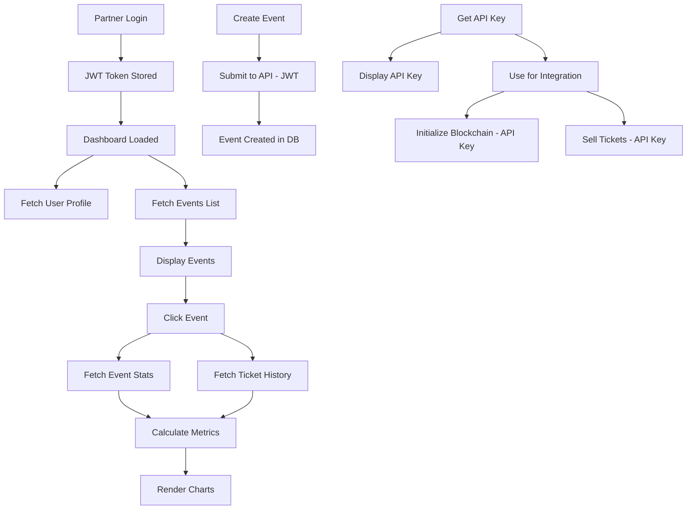

# Partner Dashboard Implementation Plan

## 🎯 Overview
Build a comprehensive Partner Dashboard for Solpass API that handles:
1. **Authentication**: Partner signup/login with JWT
2. **Event Management**: Create, view, and manage events
3. **API Key Management**: Generate and manage API keys for third-party integration
4. **Analytics Dashboard**: Visualize ticket sales, resells, and event statistics

---

## 📊 Current Project Analysis

### Existing Structure
```
app/
  ├── page.tsx              # Home page (needs auth redirect)
  ├── layout.tsx            # Root layout
  ├── events/
  │   ├── page.tsx          # Events list (needs partner filter)
  │   └── [eventId]/
  │       └── page.tsx      # Event details (needs stats)
components/
  ├── create-event-dialog.tsx  # Existing event creation
  ├── mode-switcher.tsx        # Existing mode switcher
  └── ui/                      # ShadcN UI components
lib/
  ├── api-client.ts         # API integration
  ├── api-schema.ts         # TypeScript types (auto-generated)
  └── hooks/
      ├── use-auth.tsx      # Existing auth hook (needs enhancement)
      └── use-mode.tsx      # Mode management
```

### API Endpoints Available
- **JWT Auth**: `/api/v1/auth/register`, `/api/v1/auth/login`, `/api/v1/auth/me`
- **API Key Management**: `/api/v1/auth/api-key`, `/api/v1/auth/regenerate-key`
- **Events**: CRUD operations, stats, blockchain operations
- **Tickets**: Purchase, resell, history tracking

---

## 🏗️ Implementation Plan

## Phase 1: Authentication System

### 1.1 Auth Pages

#### **app/auth/signup/page.tsx**
```typescript
Features:
- Email, password, wallet address form
- Form validation (Zod schema)
- API key displayed once after registration
- "Save your API key" warning modal
- Auto-redirect to dashboard on success
- Link to login page

Components needed:
- SignupForm
- ApiKeyDisplayModal (show once, warn about saving)
```

#### **app/auth/login/page.tsx**
```typescript
Features:
- Email and password form
- Form validation
- JWT token storage (localStorage/cookies)
- Remember me option
- Redirect to dashboard on success
- Link to signup page
- Password reset link (future)

Components needed:
- LoginForm
```

#### **app/auth/layout.tsx**
```typescript
Features:
- Centered auth layout
- Redirect to dashboard if already authenticated
- Solpass branding
- Background design
```

### 1.2 Auth Hook Enhancement

#### **lib/hooks/use-auth.tsx** (Enhanced)
```typescript
Features:
- Login/logout/register functions
- JWT token management
- User profile state (from /auth/me)
- API key retrieval/regeneration
- Auth state persistence
- Auto-refresh token logic (future)
- Loading and error states

Interface:
{
  user: User | null
  apiKey: string | null
  isLoading: boolean
  isAuthenticated: boolean
  login: (email, password) => Promise<void>
  register: (email, password, wallet) => Promise<{ apiKey: string }>
  logout: () => void
  getApiKey: () => Promise<string>
  regenerateApiKey: () => Promise<string>
  fetchProfile: () => Promise<void>
}
```

### 1.3 Protected Route Wrapper

#### **components/auth/protected-route.tsx**
```typescript
Features:
- Check authentication status
- Redirect to /auth/login if not authenticated
- Show loading spinner during auth check
- Wrap all protected pages
```

---

## Phase 2: Dashboard Layout & Navigation

### 2.1 Dashboard Layout

#### **app/dashboard/layout.tsx**
```typescript
Features:
- Sidebar navigation:
  - Dashboard (overview)
  - Events
  - API Keys
  - Settings
- Top header:
  - User profile dropdown
  - Wallet address display
  - Logout button
- Protected route (requires auth)
- Responsive design (mobile menu)

Components:
- DashboardSidebar
- DashboardHeader
- UserProfileDropdown
```

### 2.2 Dashboard Home

#### **app/dashboard/page.tsx**
```typescript
Features:
- Overview cards:
  - Total Events (count)
  - Total Tickets Sold (sum)
  - Total Revenue (sum of ticket prices)
  - Active Events (upcoming events)
- Recent events list (last 5)
- Quick actions:
  - Create Event button
  - View All Events button
- Weekly sales chart

Components:
- StatsCard
- RecentEventsList
- WeeklySalesChart
```

---

## Phase 3: Event Management

### 3.1 Events List Page

#### **app/dashboard/events/page.tsx**
```typescript
Features:
- Filterable events list:
  - Search by name
  - Filter by status (upcoming, past, all)
  - Filter by blockchain status
- Events displayed as cards:
  - Event name, date, venue
  - Ticket stats (sold/total)
  - Blockchain status badge
  - Actions: View, Edit, Delete
- Pagination
- "Create Event" button (top right)
- Empty state (no events yet)

Components:
- EventsListHeader (search, filters, create button)
- EventCard
- EventsPagination
- EmptyEventsState
```

### 3.2 Create Event Page

#### **app/dashboard/events/new/page.tsx**
```typescript
Features:
- Multi-step form:
  Step 1: Basic Info
    - Event ID (max 16 chars)
    - Event name
    - Description
    - Venue
    - Event date (date picker)
  
  Step 2: Ticket Configuration
    - Total tickets
    - Ticket price (USDC)
  
  Step 3: Royalty Distribution
    - Dynamic party list
    - Party name
    - Percentage (auto-validate to 100%)
    - Wallet address (optional initially)
  
  Step 4: Review & Submit

- Form validation (Zod)
- Progress indicator
- Save as draft (future)
- Submit to database (JWT auth)
- Note: Blockchain initialization separate (via API key)

Components:
- CreateEventWizard
- BasicInfoStep
- TicketConfigStep
- RoyaltyDistributionStep
- ReviewStep
- RoyaltyPartnerInput (reusable)
```

### 3.3 Event Details Page

#### **app/dashboard/events/[eventId]/page.tsx**
```typescript
Features:
- Event information display:
  - Basic details (name, date, venue, description)
  - Blockchain status
  - Created/updated timestamps
  
- Action buttons:
  - Edit Event (if not blockchain-enabled)
  - Delete Event (if not blockchain-enabled)
  - Initialize Blockchain (if not initialized)
  - Enable Partner USDC Accounts
  - Distribute Royalties (if blockchain-enabled)
  
- Tabs:
  1. Overview (stats)
  2. Tickets (list of all tickets)
  3. Royalty Partners (list with percentages)
  4. Blockchain Info (addresses, status)

Components:
- EventHeader
- EventActionBar
- EventTabs
- EventOverviewTab
- EventTicketsTab
- EventPartnersTab
- EventBlockchainTab
```

### 3.4 Event Statistics Tab

#### **app/dashboard/events/[eventId]/stats/page.tsx**
```typescript
Features:
- Key metrics cards:
  - Total Tickets
  - Tickets Sold
  - Tickets Resold
  - Total Revenue
  - Escrow Balance
  - Average Resale Price

- Charts:
  1. Sales Timeline (daily/weekly)
  2. Resale Activity (line chart)
  3. Revenue Breakdown (pie chart: primary vs resale)
  4. Ticket Status (sold/available/resold)

- Ticket History Table:
  - Ticket ID
  - Buyer wallet (truncated)
  - Price
  - Type (primary/resale)
  - Timestamp
  - Transaction link (Solscan)

- Export data (CSV) (future)

Components:
- StatsMetricCard
- SalesTimelineChart
- ResaleActivityChart
- RevenueBreakdownChart
- TicketStatusChart
- TicketHistoryTable
```

### 3.5 Edit Event Page

#### **app/dashboard/events/[eventId]/edit/page.tsx**
```typescript
Features:
- Pre-filled form with current event data
- Only editable fields:
  - Name
  - Description
  - Venue
  - Event date
  - Royalty partner wallet addresses (if missing)
- Cannot edit if blockchain-enabled (show warning)
- Validation
- Submit updates

Components:
- EditEventForm (reuse create form components)
```

---

## Phase 4: API Key Management

### 4.1 API Keys Page

#### **app/dashboard/api-keys/page.tsx**
```typescript
Features:
- Current API key display:
  - Masked format: sk_abc...xyz (show first 4, last 4)
  - "Show full key" button (requires confirmation)
  - Copy to clipboard button
  - Last used timestamp (future)

- Regenerate API key section:
  - Warning about invalidation
  - Confirmation dialog
  - Display new key once
  - Download as .env file

- Usage guide:
  - Integration examples
  - Link to API documentation
  - Code snippets (TypeScript, cURL)

- Security best practices:
  - Don't commit to Git
  - Use environment variables
  - Rotate periodically

Components:
- ApiKeyDisplay
- ApiKeyRegenerateButton
- ApiKeyConfirmationDialog
- ApiKeyUsageGuide
- CodeSnippet (syntax highlighted)
```

---

## Phase 5: Analytics Dashboard

### 5.1 Dashboard Analytics

#### **app/dashboard/analytics/page.tsx**
```typescript
Features:
- Time range selector (Last 7 days, 30 days, 90 days, All time)
- Overall metrics:
  - Total ticket sales (count)
  - Total revenue (USDC)
  - Average ticket price
  - Total resales
  - Resale revenue

- Charts:
  1. Sales Over Time (line chart)
     - Primary sales vs Resales
     - Daily/Weekly/Monthly view
  
  2. Top Selling Events (bar chart)
     - Event name vs tickets sold
     - Top 5 events
  
  3. Revenue Distribution (pie chart)
     - By event
     - Primary vs Resale
  
  4. Resale Activity (area chart)
     - Resale count over time
     - Average resale price trend

- Event performance table:
  - Event name
  - Total tickets
  - Sold count
  - Resold count
  - Revenue
  - Resale revenue
  - Avg resale price
  - Sortable columns

Components:
- AnalyticsDashboard
- TimeRangeSelector
- MetricCard
- SalesOverTimeChart
- TopSellingEventsChart
- RevenueDistributionChart
- ResaleActivityChart
- EventPerformanceTable
```

---

## 🎨 Component Library

### Reusable Components to Build

#### **1. Data Display Components**
```typescript
// components/dashboard/stats-card.tsx
- Icon
- Label
- Value
- Change percentage (optional)
- Trend indicator

// components/dashboard/metric-card.tsx
- Large value display
- Description
- Loading state
- Error state

// components/dashboard/data-table.tsx
- Generic table with sorting
- Pagination
- Search/filter
- Loading skeleton
- Empty state
```

#### **2. Chart Components** (using Recharts/Chart.js)
```typescript
// components/charts/line-chart.tsx
- Time series data
- Multiple series support
- Tooltips
- Legends
- Responsive

// components/charts/bar-chart.tsx
- Categorical data
- Horizontal/vertical
- Stacked option

// components/charts/pie-chart.tsx
- Percentage breakdown
- Legend
- Interactive tooltips

// components/charts/area-chart.tsx
- Filled line charts
- Multiple areas
- Gradient fills
```

#### **3. Form Components**
```typescript
// components/forms/event-form.tsx
- Reusable for create/edit
- Validation with react-hook-form + Zod
- Error display
- Loading states

// components/forms/royalty-partner-input.tsx
- Dynamic add/remove partners
- Percentage validation
- Wallet address input
- Total percentage display
```

#### **4. UI Feedback Components**
```typescript
// components/ui/confirmation-dialog.tsx
- Dangerous action confirmation
- Custom message
- Confirm/Cancel buttons

// components/ui/copy-button.tsx
- Copy to clipboard
- Success feedback

// components/ui/loading-skeleton.tsx
- Card skeletons
- Table skeletons
- Chart skeletons

// components/ui/empty-state.tsx
- Icon
- Message
- Call to action
```

---

## 📊 Data Visualization Strategy

### Available Data from API

#### From `/api/v1/events/:id/stats` (JWT)
```typescript
{
  totalTickets: number
  ticketsSold: number
  availableTickets: number
  // May need to calculate from ticket history:
  ticketsResold?: number
  totalRevenue?: number
  resaleRevenue?: number
}
```

#### From `/api/v1/events/:eventId/tickets` (Public)
```typescript
{
  tickets: Array<{
    id: string
    ticketId: string
    currentOwner: string
    currentPrice: number
    originalPrice: number
    status: string
    purchaseDate: Date
    // ... more fields
  }>
}
```

#### From `/api/v1/events/:eventId/tickets/:ticketId/history` (Public)
```typescript
{
  history: Array<{
    id: string
    ticketId: string
    fromWallet: string
    toWallet: string
    price: number
    transactionType: 'INITIAL_SALE' | 'RESALE'
    timestamp: Date
    transactionHash: string
  }>
}
```

### Derived Metrics (Calculate Client-Side)

```typescript
// For each event:
1. Tickets Resold Count:
   - Filter ticket history where transactionType === 'RESALE'
   - Count unique ticketIds

2. Total Revenue:
   - Sum all ticket history prices where transactionType === 'INITIAL_SALE'

3. Resale Revenue:
   - Sum all ticket history prices where transactionType === 'RESALE'

4. Average Resale Price:
   - Average of prices where transactionType === 'RESALE'

5. Daily/Weekly Sales:
   - Group ticket history by date
   - Count transactions per day/week
   - Split by transactionType

6. Resale Rate:
   - (Tickets Resold / Tickets Sold) * 100

7. Price Appreciation:
   - (Average Resale Price - Original Price) / Original Price * 100
```

### Weekly Data Aggregation

```typescript
// components/charts/weekly-sales-chart.tsx
function aggregateWeeklyData(ticketHistory) {
  const weeks = groupByWeek(ticketHistory)
  
  return weeks.map(week => ({
    week: week.label, // "Week 1", "Week 2"
    primarySales: week.filter(t => t.transactionType === 'INITIAL_SALE').length,
    resales: week.filter(t => t.transactionType === 'RESALE').length,
    revenue: week.reduce((sum, t) => sum + t.price, 0)
  }))
}
```

---

## 🔐 Security & Best Practices

### 1. Token Management
```typescript
// lib/auth/token-storage.ts
- Store JWT in httpOnly cookie (preferred) or localStorage
- Auto-refresh before expiry (if API supports)
- Clear on logout
- Validate token on protected routes
```

### 2. API Client Enhancement
```typescript
// lib/api-client.ts enhancements
- Automatic JWT injection from auth hook
- Request/response interceptors
- Error handling (401 → logout, 403 → show error)
- Retry logic
- Loading states
```

### 3. Form Validation
```typescript
// lib/validations/event-schema.ts
import { z } from 'zod'

export const createEventSchema = z.object({
  eventId: z.string().max(16).regex(/^[a-zA-Z0-9-]+$/),
  name: z.string().min(3).max(100),
  description: z.string().min(10),
  venue: z.string().min(3),
  eventDate: z.date().min(new Date()),
  totalTickets: z.number().min(1).max(100000),
  ticketPrice: z.number().min(0.01),
  royaltyDistribution: z.array(royaltyPartnerSchema)
    .refine(partners => {
      const total = partners.reduce((sum, p) => sum + p.percentage, 0)
      return total === 100
    }, "Royalty percentages must sum to 100%")
})
```

---

## 🎯 Implementation Phases Priority

### **Phase 1: Core Authentication** (Week 1)
- [ ] Signup page
- [ ] Login page
- [ ] Enhanced use-auth hook
- [ ] Protected route wrapper
- [ ] JWT token management

### **Phase 2: Dashboard Layout** (Week 1-2)
- [ ] Dashboard layout with sidebar
- [ ] Dashboard home (overview)
- [ ] Navigation structure
- [ ] User profile dropdown

### **Phase 3: Event Management** (Week 2-3)
- [ ] Events list page
- [ ] Create event wizard
- [ ] Event details page
- [ ] Edit event page
- [ ] Event actions (initialize, distribute)

### **Phase 4: API Key Management** (Week 3)
- [ ] API keys page
- [ ] Display current key
- [ ] Regenerate functionality
- [ ] Usage documentation

### **Phase 5: Analytics Dashboard** (Week 4)
- [ ] Fetch and aggregate ticket data
- [ ] Event statistics page
- [ ] Charts implementation
- [ ] Weekly/daily aggregations
- [ ] Overall analytics dashboard

### **Phase 6: Polish & Optimization** (Week 5)
- [ ] Loading states
- [ ] Error handling
- [ ] Empty states
- [ ] Responsive design
- [ ] Performance optimization
- [ ] Testing

---

## 📦 Dependencies to Add

```json
{
  "dependencies": {
    "react-hook-form": "^7.x", // Form management
    "zod": "^3.x", // Schema validation
    "@hookform/resolvers": "^3.x", // Zod + react-hook-form
    "recharts": "^2.x", // Charts library
    "date-fns": "^3.x", // Date manipulation
    "sonner": "^1.x", // Toast notifications
    "@tanstack/react-query": "^5.x", // Data fetching (already in use?)
    "lucide-react": "^0.x" // Icons (if not already added)
  }
}
```

---

## 🎨 UI/UX Considerations

### Design Principles
1. **Dashboard First**: Partner sees their events immediately after login
2. **Progressive Disclosure**: Don't overwhelm with all data at once
3. **Clear CTAs**: "Create Event" button prominently placed
4. **Feedback**: Loading states, success/error messages for all actions
5. **Responsive**: Mobile-friendly for viewing stats on-go
6. **Accessibility**: WCAG 2.1 AA compliant

### Color Coding
- 🟢 Green: Active/Success (blockchain enabled, revenue)
- 🔵 Blue: Info (pending actions, stats)
- 🟠 Orange: Warning (missing wallet addresses)
- 🔴 Red: Error/Danger (delete actions)
- ⚪ Gray: Disabled/Past events

### Empty States
- No events yet → "Create your first event" CTA
- No tickets sold → "Waiting for first sale" message
- No resales → "No resale activity yet"
- No API key usage → "Start integrating"

---

## 🔄 Data Flow



---


## 📝 Next Steps

1. **Review this plan** with the team
2. **Set up project dependencies**
3. **Create UI component library** (or use ShadcN - already in project)
4. **Start with Phase 1** (Auth system)
5. **Iterate and gather feedback**

---

## 📚 Additional Resources

- **API Documentation**: `API_KEY_GUIDE.md`
- **Implementation Summary**: `IMPLEMENTATION_SUMMARY.md`
- **API Schema**: `lib/api-schema.ts` (auto-generated)
- **ShadcN Components**: https://ui.shadcn.com/

---

## ❓ Open Questions

1. **Token Refresh**: Does API support refresh tokens?
2. **Real-time Updates**: Should we poll for ticket sales or use webhooks?
3. **Branding**: Solpass logo, color scheme, fonts?
4. **Analytics Retention**: How far back should historical data go?
5. **Export Features**: CSV export for event data?
6. **Multi-user**: Can partners have team members?

---

## 🎉 Success Metrics

- Partner can sign up and login in < 2 minutes
- Create event in < 5 minutes
- View event statistics instantly
- API key retrieval in 1 click
- Dashboard loads in < 2 seconds
- All actions have clear feedback

---

**Ready to build! Let's start with Phase 1: Authentication System** 🚀
